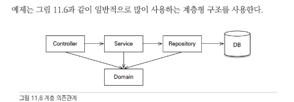
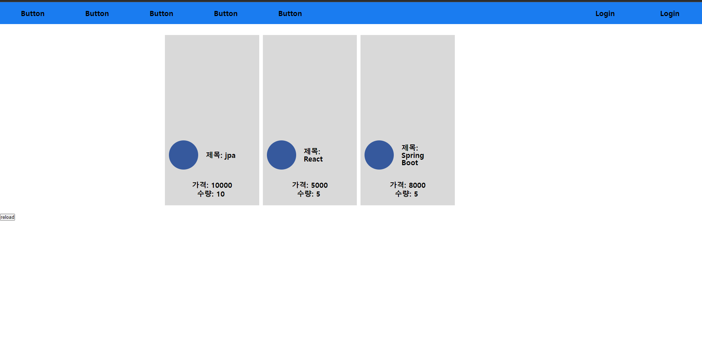

# study

## 기능

 펼치기/접기

### 회원 기능
 - 회원 등록
 - 회원 목록 조회

### 상품 기능
- 상품 등록
- 상품 목록 조회
- 상품 수정

### 주문 가능
- 상품 주문
- 주문 내역 조회
- 주문 취소

### 제외 내용
- 로그인과 권한 관리는 하지 않는다.
- 파라미터 검증과 예외 처리는 하지 않는다.
- 삼품은 도서만 사용한다.
- 카테고리는 사용하지 않는다.
- 배송 정보는 사용하지 않는다.

## 개발방법

펼치기/접기

- Controller : mvc의 컨트롤러가 모여 있는 곳이다. 컨트롤러는 서비스 계층을 호출하고 결과를 뷰에 전달한다.
- Service : 서비스 계층에는 비즈니스 로직이 있고 트랜잭션을 시작한다. 서비스 계층은 데이터 접근 계층인 리포지토리를 호출한다.
- Repository : JPA를 직접 사용하는 곳은 리포지토리 계층이다. 여기서 엔티티 매니저를 사용해서 엔티티를 저장하고 조회한다.
- Domain : 엔티티가 모여있는 계층이다. 모든 계층에서 사용한다.

# Demo

## 아이템 리스트 페이지

